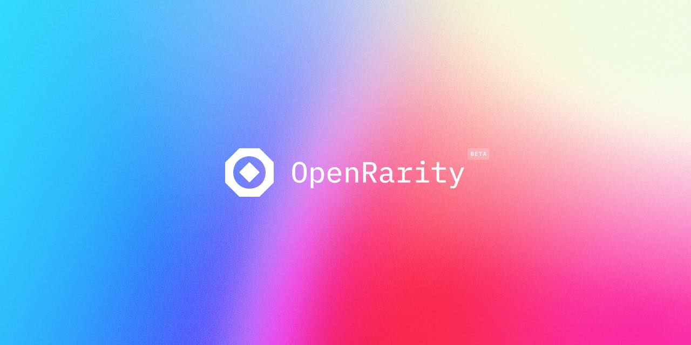

[![Version][version-badge]][version-link]
[![Test CI][ci-badge]][ci-link]
[![License][license-badge]][license-link]


# OpenRarity

We’re excited to announce OpenRarity(Beta), a new rarity protocol we’re building for the NFT community. Our objective is to provide a transparent rarity calculation that is entirely open-source, objective, and reproducible.

With the explosion of new collections, marketplaces and tooling in the NFT ecosystem, we realized that rarity ranks often differed across platforms which could lead to confusion for buyers, sellers and creators. We believe it’s important to find a way to provide a unified and consistent set of rarity rankings across all platforms to help build more trust and transparency in the industry.

We are releasing the OpenRarity library in a Beta preview to crowdsource feedback from the community and incorporate it into the library evolution.

See the full announcement in the [blog post](https://mirror.xyz/openrarity.eth/-R8ZA5KCMgqtsueySlruAhB77YBX6fSnS_dT-8clZPQ).

# Developer documentation

Read [developer documentation](https://openrarity.gitbook.io/developers/) on how to integrate with OpenRarity.

# Setup and run tests locally

```
poetry install # install dependencies locally
poetry run pytest # run tests
```

Some tests are skipped by default due to it being more integration/slow tests.
To run resolver tests:
```
poetry run pytest -k test_testset_resolver --run-resolvers
```

# Library usage
You can install open rarity as a [python package](https://pypi.org/project/open-rarity/) to use OpenRarity in your project:
```
pip install open-rarity
```
Please refer to the [scripts/](/scripts/) folder for an example of how to use the library.

If you have downloaded the repo, you can use OpenRarity shell tool to generate json or csv outputs of OpenRarity scoring and ranks for any collections:
```
python -m scripts.score_real_collections boredapeyachtclub proof-moonbirds
```
Read [developer documentation](https://openrarity.gitbook.io/developers/) for advanced library usage


# Contributions guide and governance

OpenRarity is a community effort to improve rarity computation for NFTs (Non-Fungible Tokens). The core collaboration group consists of four primary contributors: [Curio](https://curio.tools), [icy.tools](https://icy.tools), [OpenSea](https://opensea.io) and [Proof](https://www.proof.xyz/)

OpenRarity is an open-source project and all contributions are welcome. Consider following steps when you request/propose contribution:

- Have a question? Submit it on OpenRarity GitHub  [discussions](https://github.com/ProjectOpenSea/open-rarity/discussions) page
- Create GitHub issue/bug with description of the problem [link](https://github.com/ProjectOpenSea/open-rarity/issues/new?assignees=impreso&labels=bug&template=bug_report.md&title=)
- Submit Pull Request with proposed changes
- To merge the change in the `main` branch you required to get at least 2 approvals from the project maintainer list
- Always add a unit test with your changes

We use git-precommit hooks in OpenRarity repo. Install it with the following command
```
poetry run pre-commit install
```

# Project Setup and Core technologies

We used the following core technologies in OpenRarity:

- Python ≥ 3.10.x
- Poetry for dependency management
- Numpy ≥1.23.1
- PyTest for unit tests

# License

Apache 2.0 , OpenSea, ICY, Curio, PROOF


[license-badge]: https://img.shields.io/github/license/ProjectOpenSea/open-rarity
[license-link]: https://github.com/ProjectOpenSea/open-rarity/blob/main/LICENSE
[ci-badge]: https://github.com/ProjectOpenSea/open-rarity/actions/workflows/tests.yaml/badge.svg
[ci-link]: https://github.com/ProjectOpenSea/open-rarity/actions/workflows/tests.yaml
[version-badge]: https://img.shields.io/github/v/release/ProjectOpenSea/open-rarity
[version-link]: https://github.com/ProjectOpenSea/open-rarity/releases?display_name=tag
